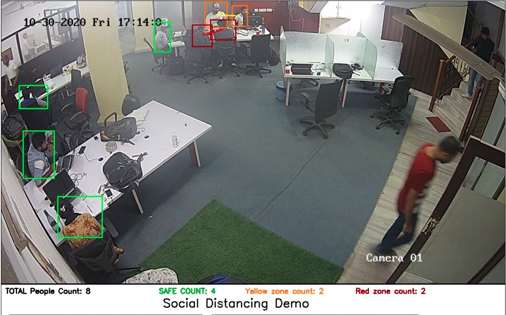

## Project Summary
A solution based on Deep Learning to detect people in the office room and find the distance between them to get track of social distancing.

## Algorithmic Concepts

- Preprocessing the dataset
- Train model on YoloV3 for person detection

#### People detection in frame

    
     
    People in the frame with distancing alert system.

## Technologies
Project is created with:
* Flask
* OpenCV
* numpy
* YOLO
